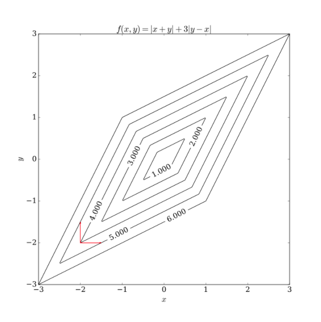

```{r setup, include=FALSE}
knitr::opts_chunk$set(echo = TRUE)
```

## Getting to know coordinate descent
This task is to program up a coordinate descent method. 

### What is coordinate descent?
Coordinate descent is the fine art of optimizing a function one direction at a time. It's not the fastest method out there (in terms of iteration count, it is slower than gradient descent and Newton's method), but it can be useful for very large scale problems. It is also a method that works to solve the Lasso problem.

In general, coordinate descent is fine when the loss function is smooth and convex, or when it is the sum of a smooth convex function and a separable, convex non-differentiable function (eg the Lasso). It does not work without the assumption of separability for the non-differentiable part, as as [this picture](https://en.wikipedia.org/wiki/Coordinate_descent) demonstrates .
escent.svg) 

To write the algorithm in general we need some notation. Let $f(\beta)$ be the function we are trying to minimize. Let $\beta_{-j}$ be all of the elements of $\beta$ _except_ $\beta_j$. Finally, we will need to be able to separate out a single $\beta_j$ within $f(\beta))$. We do this by writing $f_j(\beta_j; \beta_{-j}) = f(\beta)$. 

The algorithm can be written as follows:

- Choose an initial vector $\beta$
- Until convergence is reach (or the maximum number of iterations is exceeded)
  - for (j in 1:p)
    - Set $\beta_j = \arg \min_b f_j(b; \beta_{-j})$
    
### Applying coordinate descent to linear regression

The linear regression loss function is 
\begin{align*}
f(\beta) &= \|y - X \beta \|_2^2 \\
&= y^T y - 2 y^TX\beta + \beta^TX^TX \beta.
\end{align*}

### 1. Derive $f_j(\beta_j; \beta_{-j})$

The easiest way to do this is to write the objective function as 
$$
 \| y - X_{-j} \beta_{-j} - \beta_j X_j\|_2^2 = \| r_j - \beta_j X_j\|_2^2 := f_j(\beta_j; \beta_{-j}),
$$
where $X_{-j}$ has all of the columns of $X$ except the $j$th one and $r_j = y - X_{-j}\beta_{-j}$ is the $j$th partial residual.

### 2. Come up with a method to check for convergence

An easy possibiilty is that we have convergence if $f(\beta^{k}) - f(\beta^{k+1}) < \epsilon$.  

A less good option is to check $|\nabla f(\beta^k)| < \epsilon$. The reason that this is less good than the other option is that 
it requires the computation of the gradient, which the rest of the algorithm doesn't need.

## 3. Implement the coordinate descent algorithm

```{r}
linear_reg_cd <- function(X, y, beta0 = NULL, eps = 0.0001, iter_max = 1000, 
                          beta_true = NULL) {
  ## beta_true is a true solution. If it is included, then the error at each
  ## step is saved and that is outputted in the list 
  
  p <- dim(X)[2]
  n <- length(y)
  if(!is.null(beta0)){
    beta <- beta0
  } else {
    beta0 <- rep(0, p)
    beta <- beta0
  }
  
  if(!is.null(beta_true)) {
    # preallocate
    err_true <- rep(NA, iter_max)
    }
  
  for (i in 1:iter_max){
    for(j in 1:p) {
      rj = y - X[,-j] %*% beta[-j]
      ## lm( rj ~ 0 + X[,j])
      beta[j] <- t(X[,j]) %*%rj / sum(X[,j]^2)
    }
    
    if(!is.null(beta_true)) {
      err_true[i] <- sqrt(sum(beta-beta_true))
    }
    
    if (max(abs(beta - beta0)) < eps) { #converged
      if(!is.null(beta_true)) {
        return(list(success = TRUE, iter = i, beta = beta, err_true = err_true))
    }
      return(list(success = TRUE, iter = i, beta = beta))
    }
    beta0 = beta # keep track of  the old beta for convergence check
  }
  # If we get here we have exceeded iter_max
  warning("Convergence took more than iter_max iterations")
  if(!is.null(beta_true)) {
      return(list(success = TRUE, iter = i, beta = beta, err_true = err_true))
  }
  return(success = FALSE, iter = iter_max, beta = beta)
}

```

We can use this on some data:
```{r}
library(tidymodels)

data("airquality")
airquality <- airquality %>% remove_missing() %>% transmute(log_ozone = log(Ozone),
                                                    solar = Solar.R,
                                                    wind = Wind,
                                                    temp = Temp,
                                                    month = factor(Month),
                                                    day = factor(Day))

# Do some quick prep. Centre everything and then make the factors into dummy
# variables
rec <- recipe(log_ozone ~ . , data = airquality) %>% 
  step_normalize(all_numeric()) %>% step_dummy(all_nominal())

dat <- rec %>% prep %>% juice  # make the recipe!

X <- dat %>% select( -log_ozone) %>% as.matrix
y <- dat$log_ozone
beta_true <- solve(t(X) %*% X, t(X) %*% y)
sol <- linear_reg_cd(X, y, eps = 1e-10, beta_true = beta_true)

plot(sol$err_true %>% na.omit, type = "l", log="y")


```

### 4. How would the algorithm change for Ridge Regression?
```{r}
ridge_reg_cd <- function(X, y,lambda = 0, beta0 = NULL, eps = 0.0001, iter_max = 1000, 
                          beta_true = NULL) {
  ## beta_true is a true solution. If it is included, then the error at each
  ## step is saved and that is outputted in the list 
  
  p <- dim(X)[2]
  n <- length(y)
  if(!is.null(beta0)){
    beta <- beta0
  } else {
    beta0 <- rep(0, p)
    beta <- beta0
  }
  
  if(!is.null(beta_true)) {
    # preallocate
    err_true <- rep(NA, iter_max)
    }
  
  for (i in 1:iter_max){
    for(j in 1:p) {
      rj = y - X[,-j] %*% beta[-j]
      ## (x'x + lambda) beta = x'y
      beta[j] <- t(X[,j]) %*%rj / (sum(X[,j]^2) + lambda)
    }
    
    if(!is.null(beta_true)) {
      err_true[i] <- sqrt(sum(beta-beta_true))
    }
    
    if (max(abs(beta - beta0))/max(abs(beta)) < eps) { #converged
      if(!is.null(beta_true)) {
        return(list(success = TRUE, iter = i, beta = beta, err_true = err_true))
    }
      return(list(success = TRUE, iter = i, beta = beta))
    }
    beta0 = beta # keep track of  the old beta for convergence check
  }
  # If we get here we have exceeded iter_max
  warning("Convergence took more than iter_max iterations")
  if(!is.null(beta_true)) {
      return(list(success = TRUE, iter = i, beta = beta, err_true = err_true))
  }
  return(success = FALSE, iter = iter_max, beta = beta)
}

lambda = 0.3

beta_true <- solve(t(X) %*% X + lambda * diag(dim(X)[2]), t(X) %*% y)
sol <- ridge_reg_cd(X, y, lambda, eps = 1e-10, beta_true = beta_true)

plot(sol$err_true %>% na.omit, type = "l", log="y")
```