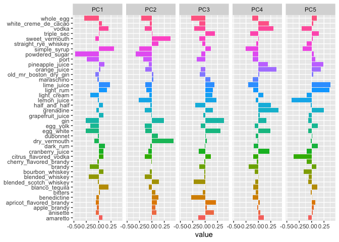
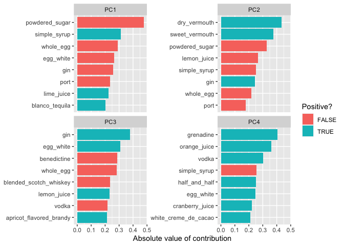

PCA: Principal Component Analysis
================
Jin Seo Jo
30/09/2020

``` r
library(tidyverse)
library(tidymodels)
library(tidytext)
library(janitor)
```

Note: `tidymodels` package is acollection of R packages that are made
for doing machine learning modelling.

The simplest version of the workflow is  
1\. Define a **recipe** for your data preparation. This helps formalize
the steps in your analysis workflow.  
2\. **Prepare** your data for analysis by running the recipe on it.  
3\. **Run** your analysis and tidy up the results.

## Load the data

The data that we will use is a collection of cocktail
recipes.

``` r
boston_cocktails <- readr::read_csv("https://raw.githubusercontent.com/rfordatascience/tidytuesday/master/data/2020/2020-05-26/boston_cocktails.csv")
```

    ## Parsed with column specification:
    ## cols(
    ##   name = col_character(),
    ##   category = col_character(),
    ##   row_id = col_double(),
    ##   ingredient_number = col_double(),
    ##   ingredient = col_character(),
    ##   measure = col_character()
    ## )

``` r
nrow(boston_cocktails)
```

    ## [1] 3643

``` r
ls(boston_cocktails)
```

    ## [1] "category"          "ingredient"        "ingredient_number"
    ## [4] "measure"           "name"              "row_id"

It contains 3643 observations and 6 variables.

## Clean up the data

``` r
cocktails_parsed <- boston_cocktails %>%
  mutate(
    ingredient = str_to_lower(ingredient),
    ingredient = str_replace_all(ingredient, "-", " "),
    ingredient = str_remove(ingredient, " liqueur$"),
    ingredient = str_remove(ingredient, " (if desired)$"),
    ingredient = case_when(
      str_detect(ingredient, "bitters") ~ "bitters",
      str_detect(ingredient, "lemon") ~ "lemon juice",
      str_detect(ingredient, "lime") ~ "lime juice",
      str_detect(ingredient, "grapefruit") ~ "grapefruit juice",
      str_detect(ingredient, "orange") ~ "orange juice",
      TRUE ~ ingredient
    ),
    measure = case_when(
      str_detect(ingredient, "bitters") ~ str_replace(measure, "oz$", "dash"),
      TRUE ~ measure
    ),
    measure = str_replace(measure, " ?1/2", ".5"),
    measure = str_replace(measure, " ?3/4", ".75"),
    measure = str_replace(measure, " ?1/4", ".25"),
    measure_number = parse_number(measure),
    measure_number = if_else(str_detect(measure, "dash$"),
      measure_number / 50,
      measure_number
    )
  ) %>%
  add_count(ingredient) %>%
  filter(n > 15) %>%
  select(-n) %>%
  distinct(row_id, ingredient, .keep_all = TRUE) %>% 
  na.omit
```

    ## Warning: Problem with `mutate()` input `measure_number`.
    ## ℹ 20 parsing failures.
    ## row col expected    actual
    ## 637  -- a number For glass
    ## 671  -- a number For glass
    ## 794  -- a number For glass
    ## 878  -- a number For glass
    ## 928  -- a number For glass
    ## ... ... ........ .........
    ## See problems(...) for more details.
    ## 
    ## ℹ Input `measure_number` is `parse_number(measure)`.

    ## Warning: 20 parsing failures.
    ## row col expected    actual
    ## 637  -- a number For glass
    ## 671  -- a number For glass
    ## 794  -- a number For glass
    ## 878  -- a number For glass
    ## 928  -- a number For glass
    ## ... ... ........ .........
    ## See problems(...) for more details.

There are some warnings. They are not a sign that something is wrong,
just that something happended that we should know about.

We may notice some weird characters in the strings. For example,

``` r
ingredient = str_remove(ingredient, " liqueur$")
```

Let’s break it down. The`str_remove` function is a part of the `stringr`
package (loaded by `package(tidyverse)`). It removes something from a
string. The syntax is

``` r
str_remove(string, pattern)
```

**String**:  
In our case, `string` is each entry of the `ingredient` column.

**Pattern**:  
It is a *regualr expression pattern*, which is a way to cycle through
text to find what you need.  
Regualr expressions (or regex) is a powerful little language that let’s
us find quite complex patterns from text.  
To do that, it has a pile of special characters that mean special
things. In this case, the `$` means “end of string”.  
So `pattern = "liqueur$"` tries to find the substring ‘liqueur’ that is
at the end of the text being examined.

Examples:

``` r
# Case 1:
str_remove("this liqueur is coconut liqueur", " liqueur$")
```

    ## [1] "this liqueur is coconut"

``` r
# Case 2:
str_remove("this liqueur is coconut liqueur", " liqueur")
```

    ## [1] "this is coconut liqueur"

``` r
# Case 3:
str_remove("this liqueur is coconut", " liqueur$")
```

    ## [1] "this liqueur is coconut"

In the third case, it did not find the substring ‘liqueur’ at the end of
the search string, so it returned the string untouched. This is what we
want\!

``` r
# Case 1:
str_replace("1/2 oz of tequila", " ?1/2", ".5")
```

    ## [1] ".5 oz of tequila"

``` r
# Case 2:
str_replace("1/3 oz of tequila", " ?1/2", ".5")
```

    ## [1] "1/3 oz of tequila"

``` r
# Case 3:
str_replace("1/2 oz of 1/2 tequila", " ?1/2", ".5")
```

    ## [1] ".5 oz of 1/2 tequila"

Now check the format of the data

``` r
# View(cocktails_parsed) or
cocktails_parsed
```

    ## # A tibble: 2,542 x 7
    ##    name     category   row_id ingredient_numb… ingredient measure measure_number
    ##    <chr>    <chr>       <dbl>            <dbl> <chr>      <chr>            <dbl>
    ##  1 Gauguin  Cocktail …      1                1 light rum  2 oz              2   
    ##  2 Gauguin  Cocktail …      1                3 lemon jui… 1 oz              1   
    ##  3 Gauguin  Cocktail …      1                4 lime juice 1 oz              1   
    ##  4 Fort La… Cocktail …      2                1 light rum  1.5 oz            1.5 
    ##  5 Fort La… Cocktail …      2                2 sweet ver… .5 oz             0.5 
    ##  6 Fort La… Cocktail …      2                3 orange ju… .25 oz            0.25
    ##  7 Fort La… Cocktail …      2                4 lime juice .25 oz            0.25
    ##  8 Cuban C… Cocktail …      4                1 lime juice .5 oz             0.5 
    ##  9 Cuban C… Cocktail …      4                2 powdered … .5 oz             0.5 
    ## 10 Cuban C… Cocktail …      4                3 light rum  2 oz              2   
    ## # … with 2,532 more rows

This is what is called **long** format. Each row corresponds to one
measurement of one thing.  
But to do PCA we need out data in **wide** format.  
This is when each row tells us multiple things about an observation,
such as the whole vector \(x_i^T\).  
So we will use `pivot_wider`.

``` r
cocktails_df <- cocktails_parsed %>%
  select(-ingredient_number, -row_id, -measure) %>%
  pivot_wider(id_cols = name, 
    names_from = ingredient, 
    values_from = measure_number, 
    values_fill = 0) %>%
  janitor::clean_names() %>%
  na.omit()
```

First thing this does is delete the rows we don’t need. It then pivots
the data into a wide format.

  - The rows will come from the `id_col` arguement, so each row will be
    a specific cocktail
  - The column names come from the `names_from` argument, and are hence
    read from the column `ingredient`. This means that each ingredient
    will get it’s own column
  - The values that go in that column come from the corresponding
    `measure_number` column, or are set to zero (`values_fill`) if that
    ingredient isn’t used in that cocktail

The `clean_names` command from the `janitor` package is then called to
make sure that everthing is written consistently.  
Finally, any `NA` values are thrown away.

Then our new data look like this

``` r
cocktails_df
```

    ## # A tibble: 937 x 41
    ##    name  light_rum lemon_juice lime_juice sweet_vermouth orange_juice
    ##    <chr>     <dbl>       <dbl>      <dbl>          <dbl>        <dbl>
    ##  1 Gaug…      2           1          1               0           0   
    ##  2 Fort…      1.5         0          0.25            0.5         0.25
    ##  3 Cuba…      2           0          0.5             0           0   
    ##  4 Cool…      0           0          0               0           1   
    ##  5 John…      0           1          0               0           0   
    ##  6 Cher…      1.25        0          0               0           0   
    ##  7 Casa…      2           0          1.5             0           0   
    ##  8 Cari…      0.5         0          0               0           0   
    ##  9 Ambe…      0           0.25       0               0           0   
    ## 10 The …      0           0.5        0               0           0   
    ## # … with 927 more rows, and 35 more variables: powdered_sugar <dbl>,
    ## #   dark_rum <dbl>, cranberry_juice <dbl>, pineapple_juice <dbl>,
    ## #   bourbon_whiskey <dbl>, simple_syrup <dbl>, cherry_flavored_brandy <dbl>,
    ## #   light_cream <dbl>, triple_sec <dbl>, maraschino <dbl>, amaretto <dbl>,
    ## #   grenadine <dbl>, apple_brandy <dbl>, brandy <dbl>, gin <dbl>,
    ## #   anisette <dbl>, dry_vermouth <dbl>, apricot_flavored_brandy <dbl>,
    ## #   bitters <dbl>, straight_rye_whiskey <dbl>, benedictine <dbl>,
    ## #   egg_white <dbl>, half_and_half <dbl>, vodka <dbl>, grapefruit_juice <dbl>,
    ## #   blended_scotch_whiskey <dbl>, port <dbl>, white_creme_de_cacao <dbl>,
    ## #   citrus_flavored_vodka <dbl>, whole_egg <dbl>, egg_yolk <dbl>,
    ## #   blended_whiskey <dbl>, dubonnet <dbl>, blanco_tequila <dbl>,
    ## #   old_mr_boston_dry_gin <dbl>

We still need to get our data ready for PCA.  
What we are going to do now is describe, for our clean data, what we are
going to do before we do the PCA.

To do this, we need to define a *recipe*, which is done using the
`recipe` package, which is part of `tidymodels`.

There are two steps here:  
1\. We write the recipe `recipe()`  
2\. We get all of the ingredients in place for out analysis `prep()`

``` r
# Step 1
pca_rec <- recipe(~., data = cocktails_df) %>% 
  # Step 2
  update_role(name, new_role = "id") %>%
  # Step 3.1
  step_normalize(all_predictors()) %>%
  # Step 3.2
  step_pca(all_predictors())

pca_prep <- prep(pca_rec)

pca_prep
```

    ## Data Recipe
    ## 
    ## Inputs:
    ## 
    ##       role #variables
    ##         id          1
    ##  predictor         40
    ## 
    ## Training data contained 937 data points and no missing data.
    ## 
    ## Operations:
    ## 
    ## Centering and scaling for light_rum, lemon_juice, ... [trained]
    ## PCA extraction with light_rum, lemon_juice, ... [trained]

Interpret the codes:  
\- Step 1: ~. means “I am predicting nothing (nothing on the left of ~),
but my covariates are everything in my data (the . on the right of
~)”.  
\- Step 2: We don’t want to use the cocktail name in our PCA, so we give
it the “role” of an “id” or identification column. This will be useful
for printing etc.  
\- Step 3.1: This normalize the given data. This makes all predictor
columns (everything that isn’t an `id` column in this case) have mean
zero and standard deviation 1. We need this to make PCA work nicely and
avoid bad scaling issues.  
\- Step 3.2: This performs the PCA

`prep` function:  
\- It goes through the recipe in order and does all of the things it
says.  
\- First, it makes sure `name` is listed as an id-column.  
\- Then it scales and centres the other columns.  
\- And then it does the PCA on the non-id columns.

It’s still not in a nice form where we can use it, so we can do one
final thing. We can `tidy` the output.  
`tidy` is a function (or one function for each type of analysis) that is
bought to us by the `broom` package.  
It tries to wrangle the output into a neat format.

``` r
# Tidy the Step 3.1
# 2 means "tidy the second 'step_' of our recipe" (this is the PCA step)
tidied_pca <- tidy(pca_prep, 2)
```

``` r
# Tidy the Step 3.2
# 1 indicates normalization step
tidy(pca_prep, 1)
```

    ## # A tibble: 80 x 4
    ##    terms           statistic  value id             
    ##    <chr>           <chr>      <dbl> <chr>          
    ##  1 light_rum       mean      0.161  normalize_WNQqe
    ##  2 lemon_juice     mean      0.229  normalize_WNQqe
    ##  3 lime_juice      mean      0.138  normalize_WNQqe
    ##  4 sweet_vermouth  mean      0.0691 normalize_WNQqe
    ##  5 orange_juice    mean      0.185  normalize_WNQqe
    ##  6 powdered_sugar  mean      0.0891 normalize_WNQqe
    ##  7 dark_rum        mean      0.0454 normalize_WNQqe
    ##  8 cranberry_juice mean      0.0363 normalize_WNQqe
    ##  9 pineapple_juice mean      0.0608 normalize_WNQqe
    ## 10 bourbon_whiskey mean      0.0768 normalize_WNQqe
    ## # … with 70 more rows

`tidied_pca` is living in long format, so it’s slightly easier if we
pivot wider:

``` r
tidied_pca %>% select(-id) %>%
  pivot_wider(names_from = component, values_from = value)
```

    ## # A tibble: 40 x 41
    ##    terms     PC1     PC2      PC3      PC4     PC5     PC6      PC7      PC8
    ##    <chr>   <dbl>   <dbl>    <dbl>    <dbl>   <dbl>   <dbl>    <dbl>    <dbl>
    ##  1 ligh…  0.163  -0.112   0.152   -0.104    0.362  -0.0473  0.0708  -0.0489 
    ##  2 lemo… -0.0140 -0.265   0.232   -0.0555  -0.409  -0.304   0.0714   0.0134 
    ##  3 lime…  0.224  -0.136   0.188   -0.204    0.384   0.202  -0.160   -0.0596 
    ##  4 swee… -0.0661  0.375  -0.120    0.00427  0.0198 -0.124  -0.208   -0.00787
    ##  5 oran…  0.0308 -0.136  -0.0876   0.363    0.184  -0.320  -0.0209  -0.0252 
    ##  6 powd… -0.476  -0.327  -0.0759  -0.110    0.0456  0.160  -0.0818   0.0546 
    ##  7 dark…  0.124  -0.0356 -0.00767 -0.0975   0.129   0.0100 -0.137    0.171  
    ##  8 cran…  0.0954 -0.0703 -0.130    0.223   -0.0983  0.0845 -0.00567  0.235  
    ##  9 pine…  0.119  -0.0631  0.00113  0.195    0.239  -0.168  -0.0834   0.123  
    ## 10 bour…  0.0963 -0.0406 -0.0117  -0.0752  -0.160  -0.0488  0.137   -0.327  
    ## # … with 30 more rows, and 32 more variables: PC9 <dbl>, PC10 <dbl>,
    ## #   PC11 <dbl>, PC12 <dbl>, PC13 <dbl>, PC14 <dbl>, PC15 <dbl>, PC16 <dbl>,
    ## #   PC17 <dbl>, PC18 <dbl>, PC19 <dbl>, PC20 <dbl>, PC21 <dbl>, PC22 <dbl>,
    ## #   PC23 <dbl>, PC24 <dbl>, PC25 <dbl>, PC26 <dbl>, PC27 <dbl>, PC28 <dbl>,
    ## #   PC29 <dbl>, PC30 <dbl>, PC31 <dbl>, PC32 <dbl>, PC33 <dbl>, PC34 <dbl>,
    ## #   PC35 <dbl>, PC36 <dbl>, PC37 <dbl>, PC38 <dbl>, PC39 <dbl>, PC40 <dbl>

This is a 40x40 matrix (if we don’t include the `name` column).  
Remember that a score vector has the length of the number of cocktails
(\(n\)), while the loading vector would have the dimension of the number
of ingredients (\(p\)).

``` r
length(unique(cocktails_parsed$name))
```

    ## [1] 937

``` r
length(unique(cocktails_parsed$ingredient))
```

    ## [1] 40

This means that these are the PCA loadings, which is what we want.

We can now do some plotting.

## visualizing results

``` r
tidied_pca %>%
  filter(component %in% paste0("PC", 1:5)) %>%
  mutate(component = fct_inorder(component)) %>%
  ggplot(aes(value, terms, fill = terms)) +
  geom_col(show.legend = FALSE) +
  facet_wrap(~component, nrow = 1) +
  labs(y = NULL)
```

<!-- -->

From PC1, we can see that `powdered_sugar` and `simple_syrup` make the
biggest difference.

It would be nice to just plot the most important part of the each PC.

``` r
tidied_pca %>%
  filter(component %in% paste0("PC", 1:4)) %>%
  group_by(component) %>%
  top_n(8, abs(value)) %>%
  ungroup() %>%
  mutate(terms = reorder_within(terms, abs(value), component)) %>%
  ggplot(aes(abs(value), terms, fill = value > 0)) +
  geom_col() +
  facet_wrap(~component, scales = "free_y") +
  scale_y_reordered() +
  labs(
    x = "Absolute value of contribution",
    y = NULL, fill = "Positive?"
  )
```

<!-- -->
